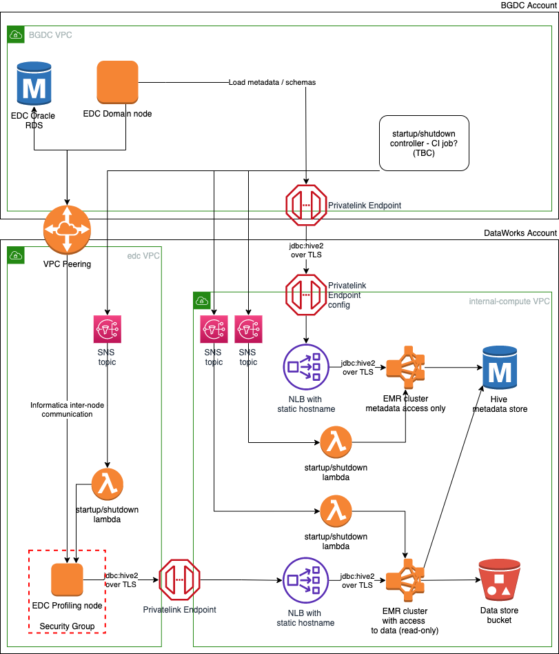
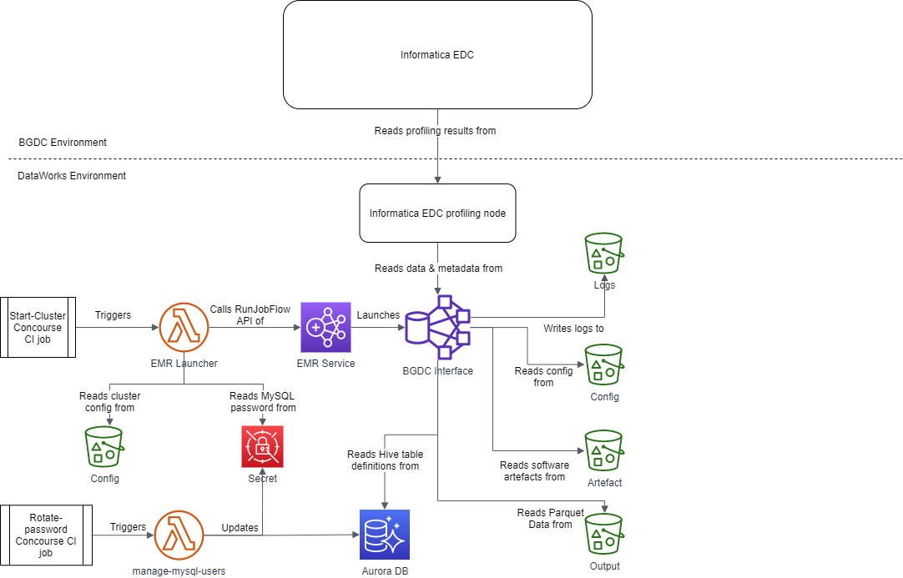
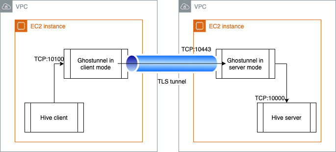

# DO NOT USE THIS REPO - MIGRATED TO GITLAB

# DataWorks interface for BGDC (Business Glossary & Data Catalog)

BGDC Interface provides a Hive endpoint for data and metadata stored in DataWorks.

## Overview

This repo builds EMR clusters that provide Hive interfaces to access data generated by [Analytical Dataset Generation](https://github.com/dwp/aws-analytical-dataset-generation).

Two clusters are built:
* bgdc-interface  
  * has access to both metadata DB in RDS and data in published bucket
  * accessed by BGDC profiling node within DataWorks boundary to perform profiling runs  
* bgdc-interface-metadata
  * only has access to metadata DB
  * accessed by BGDC Domain node to import Hive schema 



Cluster design in more detail:



Both clusters can be started and stopped on-demand using CI admin jobs. The mechanism for this involving an EMR Launcher Lambda is similar to the one used in [Analytical Dataset Generation](https://github.com/dwp/aws-analytical-dataset-generation).

## Password rotation

BGDC Interface uses a read-only MySQL user to access Hive Metastore Aurora database. The password for this user can be rotated using  CI jobs defined in `aws-internal-compute` repo and available in the associated pipeline. Please note that rotation jobs in https://github.com/dwp/aws-analytical-dataset-generation hav been deprecated.

## Protecting Hive endpoint with TLS encryption and mutual authentication



Hive offers a very limited number of options in terms of authentication and encryption - essentially, only Kerberos and LDAP for auth and no mutual TLS authentication. We've addressed this by putting a TLS proxy in front of Hive:
* Hive itself runs in default mode - no authentication or encryption but the endpoint is only exposed to the local network stack of the EC2 instance itself.
* [Ghostunnel](https://github.com/ghostunnel/ghostunnel) TLS proxy running on the Hive instance provides a TCP listener that has mutual TLS authentication enabled and authenticates & decrypts traffic before forwarding it to the Hive endpoint.
* To enable a remote client (e.g. Hive shell, Beeline or Informatica EDC) to connect to Hive server, a TLS tunnel to Hive server needs to be established first. Please refer to [TLS proxy configuration](#tls-proxy-configuration)


## Tactical solution to access Hive from BGDC

For development purposes Hive endpoint in development has been made available to BGDC sandbox environment. To access the endpoint from BGDC the following steps need to be performed in BGDC account.

### AWS / network connectivity 
* Create a security group for Privatelink VPC endpoint that allows inbound traffic on TCP port 10443 from Informatica security groups
* Create a Privatelink VPC endpoint
  * Service name: <DataWorks Hive Endpoint Services service name>
  * VPC: <name of sandbox VPC>
  * Security group: one created in the previous step
* Modify Informatica node security groups to allow outbound traffic to TCP port 10443 of the security group in step 1.

### <a name="tls-proxy-configuration">TLS proxy configuration</a>
A TLS proxy needs to be setup on each Informatica node that will access Hive endpoint. For Informatica EDC AWS Marketplace offering these are the Domain node and Gateway node.
* Download Ghostunnel binary from https://github.com/ghostunnel/ghostunnel
* Acquire a certificate/private key and CA certificate from DataWorks
* Run Ghostunnel in client mode on each node pointing it to the DNS name of VPC endpoint created above, e.g.
  ```
  ghostunnel client --listen localhost:10100 --target <vpc_endpoint_dns_name>:10443 --keystore certkey.pem --cacert dataworks_root_ca.pem
   ```
   This will create a proxy process that listens on port 10100 and establishes a TLS tunnel to Hive endpoint. 
  If you want to run the proxy in background without configuring it as a systems service you could use nohup like below:
  ```
  nohup ./ghostunnel client --listen localhost:10100 --target <vpc_endpoint_dns_name>:10443 --keystore certkey.pem --cacert dataworks_root_ca.pem &
  ```

### Informatica configuration:
* Informatica requires a cluster configuration to be loaded in a form of a zip archive containing `*-site.xml` files. Actual content of the config archive is immaterial as long as the schema is valid - the only part that matters for BGDC-DWX integration is Hive connection string and you'll be able to update it after the config archive is loaded.  
  This archive can be either downloaded from S3 location where it's put by Terraform in this repo or you could just grab the contents of `site_xml` directory and zip it up.
* After a cluster config has been loaded and cluster object created, update the Hive connection string in Hive node. In Informatica Administrator console, navigate to Manage -> Connections. In Domain Navigator, under ClusterConfigurations select HIVE_<cluster_name>. Set both `Metadata Connection String` and `Data Access Connection String` to `jdbc:hive2://localhost:10100`
* When creating a resource for DWX in Informatica Catalog Administrator, on the General tab use the same Hive Uri as above. i.e. `jdbc:hive2://localhost:10100`. Leave `user` and `password` fields empty.
